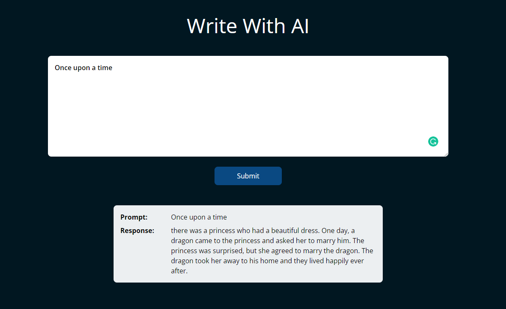

# gpt3-writer

This is a webapp made using **React**. It is used to send prompts to the GPT-3 model using OpenAI's API.

The project is initialized using **Vite** instead of **create_react_app** which is much faster as compared to the latter.
**TailwindCSS** is used for easy CSS. Which is a useful framework to write fast CSS.




## API Key
You can get your limited API key from [OpenAI](https://beta.openai.com/overview)
After retrieving the key, you can either use it directly in the "prompt.jsx" or to be safe you can use **dotenv** and save the key in a **.env** file.

## Run
You can install dependencies and run the project from inside the **client** folder.
```npm install
npm run dev
```
